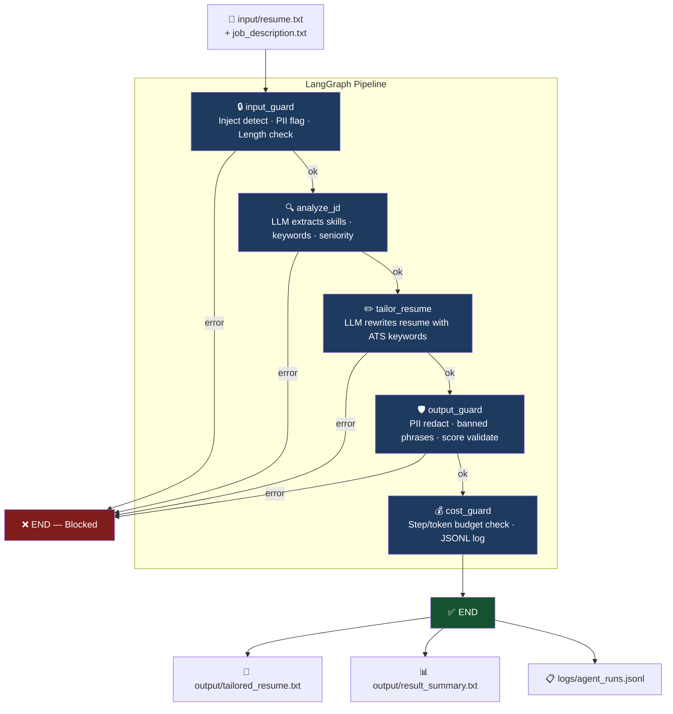

<div align="center">


[](https://git.io/typing-svg)

<br/>


</div>

---

## What Is This?

**Recruform** is a production-ready AI agent built with **LangGraph** that takes your resume and a job description, then outputs an ATS-optimized tailored version — with a match score, change log, and structured warnings. Built with multi-layer guardrails, structured logging, and a full DeepEval test suite.

---

## Flow Diagram



---

## Project Structure

```
langgraph-resume-tailoring-agent/
│
├── agent/
│   ├── __init__.py
│   ├── graph.py          # LangGraph workflow — nodes + conditional edges
│   ├── guardrails.py     # Input / Output / Action safety layer
│   ├── nodes.py          # 5 processing nodes (LLM calls + logic)
│   └── state.py          # AgentState TypedDict schema
│
├── monitoring/
│   ├── __init__.py
│   └── logger.py         # Structured JSONL logger + stats dashboard
│
├── prompts/
│   ├── __init__.py
│   ├── v1_0.py           # Prompt version 1.0 (archived)
│   └── v1_1.py           # Prompt version 1.1 (active — improved)
│
├── tests/
│   ├── __init__.py
│   ├── conftest.py       # pytest fixtures + shared test helpers
│   ├── test_normal.py    # Group 1: standard happy-path cases
│   ├── test_edge_cases.py  # Group 2: empty input, huge text, non-English
│   ├── test_adversarial.py # Group 3: prompt injection, jailbreak attempts
│   └── test_regression.py  # Group 4: known past failures re-tested
│
├── input/
│   ├── resume.txt          # ← paste your resume here
│   └── job_description.txt # ← paste target JD here
│
├── .env.example            # API key template
├── main.py                 # Entry point — orchestrates full pipeline
├── requirements.txt        # Python dependencies
└── run_tests.py            # Test runner with grouped output
```

---

## Tech Stack

| Technology | Version | Why Used |
|---|---|---|
| **LangGraph** | ≥ 0.2.0 | Explicit state machine with conditional routing — clean error propagation per node |
| **LangChain** | ≥ 0.3.0 | LLM abstraction layer — unified interface for switching models |
| **LangChain-OpenAI** | ≥ 0.2.0 | OpenAI-compatible client pointing to OpenRouter endpoint |
| **OpenRouter** | Free Tier | Zero-cost LLM access during dev; swap model with a single env var |
| **LangSmith** | ≥ 0.1.0 | Remote trace capture — full run visualization with zero infrastructure |
| **DeepEval** | ≥ 1.4.0 | LLM-specific test assertions (`G-Eval`, `Hallucination`, `Relevancy`) |
| **Pydantic** | ≥ 2.0.0 | State schema validation and data modelling |
| **python-dotenv** | ≥ 1.0.0 | Environment variable loading from `.env` |

---

## Setup & Run

### 1. Clone & Install

```bash
git clone https://github.com/shreyashpatil/langgraph-resume-tailoring-agent.git
cd langgraph-resume-tailoring-agent

python -m venv venv
# Windows:
venv\Scripts\activate
# macOS/Linux:
source venv/bin/activate

pip install -r requirements.txt
```

### 2. Configure Environment

```bash
cp .env.example .env
# Edit .env and add your keys:
```

```env
OPENROUTER_API_KEY=sk-or-v1-your_key_here
OPENROUTER_MODEL=openai/gpt-oss-20b:free

LANGCHAIN_TRACING_V2=true
LANGCHAIN_API_KEY=your_langsmith_api_key_here
LANGCHAIN_PROJECT=recruform-day9
```

> Get free OpenRouter key: [openrouter.ai](https://openrouter.ai) | LangSmith key: [smith.langchain.com](https://smith.langchain.com)

### 3. Add Your Inputs

```
input/resume.txt           ← paste your full resume here
input/job_description.txt  ← paste the target job description here
```

### 4. Run Agent

```bash
python main.py
```

### 5. Run Tests

```bash
# DeepEval test suite (all 4 groups)
deepeval test run tests/

# Or grouped test runner
python run_tests.py
```

### 6. View Monitoring Stats

```bash
python -c "from monitoring.logger import print_stats; print_stats()"
```

---

## Output Format

**`output/result_summary.txt`**

```
============================================================
  RECRUFORM - RESUME TAILORING RESULT
============================================================
  Generated  : 2026-05-05 19:46:37
  Run ID     : bcba16cb-9d2f-4ccf-b253-caf4597b2d46

  STATUS     : SUCCESS
  Match Score: 70/100
  Steps      : 5
  Tokens used: 2620
  Cost (est) : $0.001546

  WARNINGS (3):
    * Candidate has Flask experience but no FastAPI; transferable but not proven
    * Docker experience is basic; no advanced containerization demonstrated
    * No Redis or message queue experience found

  CHANGES MADE (4):
    -> Replaced generic API description with RESTful API design language to match JD
    -> Highlighted PostgreSQL schema design and query optimization
    -> Added Agile, code reviews, and technical design discussion bullets
    -> Included Docker (basic) and payment gateway integration as per Nice to Have
```

**`logs/agent_runs.jsonl`** — one JSON line per run:

```json
{
  "timestamp": "2026-05-05T19:46:37.412Z",
  "run_id": "bcba16cb-9d2f-4ccf-b253-caf4597b2d46",
  "agent": "resume_tailor_v1.1",
  "success": true,
  "match_score": 70,
  "step_count": 5,
  "token_count": 2620,
  "cost_estimate_usd": 0.00000155,
  "guardrail_flags": [],
  "warning_count": 3
}
```

---

## Key Design Decisions

| Decision | Choice | Reason |
|---|---|---|
| **State machine framework** | LangGraph over raw LangChain | Explicit node routing; easy to add/remove nodes; clear `error → END` short-circuit |
| **Defense in depth** | 3-layer guardrails (Input + Output + Action) | Each layer catches different failures — injection at input, PII at output, budget at cost_guard |
| **Versioned prompts** | `v1_0.py` → `v1_1.py` separate files | A/B testing and rollback without code changes; changelog in file header |
| **JSONL logging** | Append-only structured log | Queryable, incremental, no schema migration; each line is a valid JSON object |
| **LangSmith optional** | `LANGCHAIN_TRACING_V2=true` toggle | Full remote observability with zero infra cost; works without it too |
| **OpenRouter free tier** | `openai/gpt-oss-20b:free` default | Zero cost during development; swap to GPT-4/Claude by changing 1 env var |
| **DeepEval for tests** | 4 groups: normal, edge, adversarial, regression | Standard pytest can't evaluate semantic LLM output quality — need G-Eval + Hallucination metrics |
| **Honest scoring** | match_score is 0-100 with strict validation | Enforced by both system prompt constraints and output_guard numeric validation |

---

## Guardrail Layers

```
INPUT GUARD           OUTPUT GUARD          ACTION GUARD
──────────────        ─────────────         ─────────────
Prompt injection  →   PII redaction    →    Cost limits
PII detection     →   Banned phrases   →    Step budget
Length bounds     →   Score validation →    URL allowlist
                  →   Word count limit
```

---

<div align="center">


**Built by [Shreyash Patil](https://shreyash-orpin.vercel.app/)**

[](https://shreyash-orpin.vercel.app/)

*Day 9 of building production-grade AI agents*

</div>
